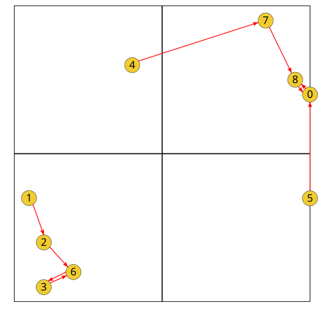

# Je vous surveille

Dans cet exercice, on a une liste de coordonnées dans un graphique cartésien.

Chaque point (représenté par un couple de coordonnées (x,y)), représente un agent. Il y a 255 agents.

Chaque agent surveille l'agent le plus proche de lui. **Donc un agent surveille obligatoirement un seul autre agent.** (Un agent ne peut pas surveiller personne ni surveiller plus d'une personne).

Chaque agent est identifié par un numéro. Il s'agit du numéro de ligne dans le fichier **donnees.txt** correspondant à ses coordonnées (1er ligne -> agent n°1, ... n-ème ligne -> n-ième agent).

**Attention** : le premier agent porte le n°0 et non 1. Donc le dernier a le n°254.

**Objectif** : retourner la liste dans l'ordre croissant des agents qui ne sont surveillés par personne.

Dans cet exemple, il faudrait retourner : 1, 4, 5 car ce sont les trois seuls agents non surveillés.

## Résolution

- lire le fichier **donnees.txt**.
- créer un dictionnaire avec en clé ne n° de l'agent et en valeur ses coordonnées pour avoir un lien entre n° agent et coordonnées (=identifier les agents).
- créer une liste des entiers de 0 à 254 pour représenter tous les 255 agents.
- faire une boucle sur toutes les clés du dictionnaire (donc sur tous les agents.). Pour chaque, calculer la distance avec tous les autres. Trouver la distance la plus petite et supprimer l'agent correspondant dans la liste des agents. De fil en aiguille, on supprimera tous les agents surveillés et il ne restera plus que les agents non surveillés.
