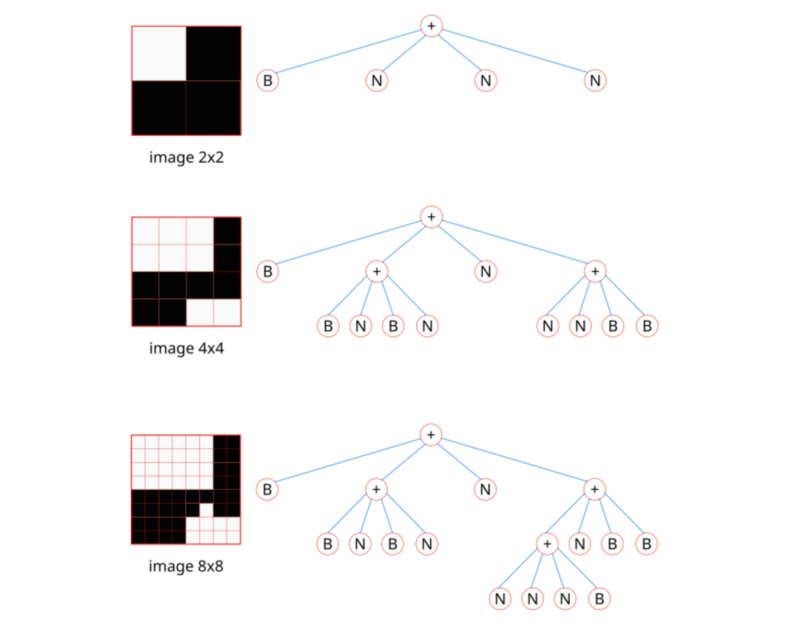

# Message Quadtree

Dans cet exercice, on nous explique comment encodé une image binaire sous forme d'un quadtree et ensuite comment compressé la chaîne formée pour se retrouver avec une chaîne de caractère à première vue anodine.

Dans un premier temps, je vais expliquer comment décomposer l'image binaire en quadtree puis dans un second temps nous verrons l'opération de compression de la chaîne de caractère.

## Image to Quadtree

Nous partons donc d'une image binaire carrée, c'est à dire composée uniquement de pixels blancs et noirs et avec une largeur équivalente à sa longueur.

On découpe l'image en 4 partie égale en traçant un segment au centre de la longueur et au centre de la largeur.

On se retrouve donc avec 4 petits carrés : 1 en haut à gauche, 1 en haut à droite, 1 en bas à gauche et 1 en bas à droite --> sens de lecture correct.

En suivant le sens de lecture correct, on regarde si un carré est entièrement blanc ou noir OU s'il est composé des 2 couleurs.

S'il n'est composé que d'une couleur, on peut noter sa valeur, B ou N.

S'il est composé des 2 couleurs, on doit à nouveau diviser le carrés en 4 nouveaux petits carrés et ainsi de suite.

De fil en aiguille, on peut descendre jusqu'à l'échelle du pixel.

Schéma de fonctionnement :



## Compression de la chaîne

Pour obtenir la chaîne, on commence par effectuer une lecture prefixe de l'arbre obtenu.

Une lecture préfixee consiste à lire l'arbre de gauche à droite et en remontant d'un cran chaque fois que la branche arrive à son extrêmité.

Concrètement, on commence par la branche la plus à gauche. Une fois qu'on arrive à la fin de cette branche, on remonte d'un cran puis on regarde si un autre chemin est possible. Si oui, on l'emprunte. Si non, on remonte encore d'un cran. Logiquement, quand plus aucun chemin n'est empruntable, c'est qu'on a fini de lire l'arbre.

Avec le dernier arbre du schéma ci-dessus, cela donne : **+B+BNBNN++NNNBNBB** .

Pour la compression, on regarde la chaîne de base et lorsqu'un caractère se répète successivement au moins 2 fois, on ne l'écrit qu'une fois mais en le précédent de son nombre d'occurrences successives.

Par exemple, pour notre de chaîne du dernier arbre du schéma, cela donne : **+B+BNB2N2+3NBN2B**.

## Objectif

On nous donne en entrée du problème une chaîne compressée.

Le but est de reconstituer l'image d'origine pour y découvrir un message.

Voici la chaîne d'entrée :

```
2+3B3+3B+3BN+2B+2B2N+2B2N+B+BNBNB+BNBN2+3BN+2B2N+BNB2N2+2B+2B2NB+2B+2BNB+3BN
2+BNBN+BNBN+BNBN+3BN2+2B3N+2N2B+N3B2+B+BNBNB+3BN2+2B2N+2B2N+2BNB+2BNB+B+3BNB
+BN2B2+2BNB+N2BN+BN2B+BN2B3+B3N+BNBN+3BN+B2NB2+N2BN+N2BN+N2BN+BN2B2+2B2N+BNB
N+N2BN+3NB2+B3N+N4B+3BN+2B3+3B+2BNB+2B+3BN+2B2N2+N3B+NB2N+2BNB+3NB2+BNBN+3BN
+BNBN+BNBN2+2B+2B2N+2B2NB2+2B2N+BNB2N+BNBNB3+BNBN+N2BN+BN2BN2+BNBN+2B2N+3BN+
2B2N+B+BN2B+BN2B+2N2B2+B3N+2BNB+NB2N+3NB3+2B2N+B3N+3BN+2BN2B2+NB2N+B3N+2BNB+
N2BN2B+B3+B+3BNB+3BN2+2N2B+B3N+NBNB+BN2B+B+3BNB+BNBN2+2B2N+2B2N+3BN+2B2N3+NB
2N+N2BN+N2BN+2NBN2+BNBN+2NB2N+B2NB2+2B2N+BNBN+BNBNB2+BNBNB+3BN+NB2N2+B+BNBNB
+BNBN2+BNB2N+2B2N+2B2N2B3+BNBN+BN2B+B3N+BNBN2+N2B2NB+3N5B4+2BN+2NBN2+3BN+N3B
+NB2N+2B2N2+2BNB+BNBN+N2BN+BNBN2+3BN+BNBN+2B2N+B3N3+3NB+2NBN+N2BN+N2BNB2+N2B
N+NB2N+3NB+B3NB3+NB2N+N3B+N2BN+BNBN2+3BN+3BN+BNBN+2NBN2B3+2NBN+3BN+N3B+2B2N6B
```

## Idées

Il est assez simple de comprendre que puisque l'on part de l'objet final du proccessus, on doit faire le mécanisme inverse pour retrouver l'objet de départ.

Il y a donc 3 grandes étapes :

- décompression de la chaîne
- reconstitution de l'arbre à partir de la chaîne
- reconstitution de l'image à partir de l'arbre

Autant la première étape semble simple, autant les 2 autres pas trop.

Pistes :

- Un signe + est forcément liés à 4 aures symboles (on pourrait être tenté de dire que chaquee + est lié au 4 lettres qui le suive mais ce n'est pas vrai lorsque 2 symboles + se suivent).
- Une lettre corresponds forcément à la fin d'une branche.
